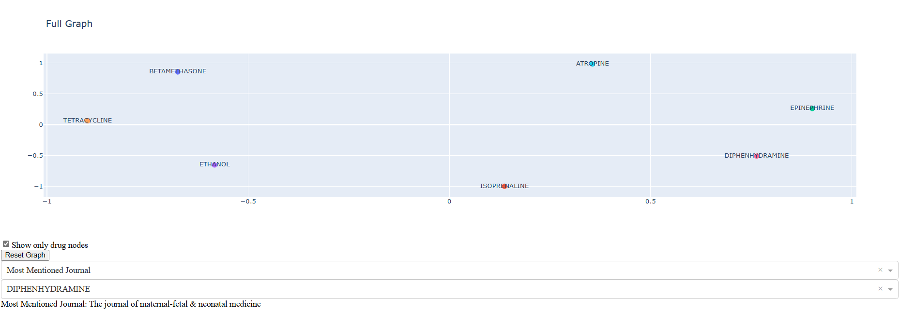

# Advanced Data Processing Pipeline Project

## Project Overview

This project implements a sophisticated data processing pipeline designed to analyze drug mentions in various publications. The pipeline is built using Apache Airflow, Python, and various data processing libraries. Key functionalities include data loading, cleaning, mention extraction, graph generation, and data output, with a special focus on the relationships between drugs and journal publications.


An interactive graph is displayed with the nodes and all the tasks such as shwoing for each drug each connection with the journal and the source (pubmed, clinical_trials) and also filtering by drug and showing the ad-hoc part (the most mentioned journal | Common Drugs)

<p float="left">
  <a href="../static/interactive_graph_relation.png" target="_blank"></a>
</p>
<p float="left">
  
  
</p>

## Features

- **Data Loading and Cleaning**: Automated scripts to load and clean data from multiple sources.
- **Mention Extraction**: Extracts mentions of drugs from different publications.
- **Graph Generation**: Creates graphical representations of drug-journal relationships using NetworkX.
- **Data Visualization**: Interactive visualization with Plotly and Dash.
- **Output Writing**: Outputs processed data in JSON format.

## Prerequisites

- Python 3.8+
- Apache Airflow 2.1+
- pandas, NetworkX, Plotly, Dash

## Installation

1. **Clone the Repository**:
   ```bash
   git clone git@github.com:HaddedAmine/Data_engineer_test.git
   ```
2. **Navigate to the Project Directory**:
   ```bash
   cd Airflow
   ```
3. **Install Dependencies**:
    
    create a .env credentails to store the Airflow identification configuration
    ```bash
   # Airflow environment variables
   AIRFLOW_SECRET_KEY=Your_secret_key_here
   AIRFLOW_USERNAME=Your_username
   AIRFLOW_PASSWORD=Your_password
   ```

   ```bash
   docker-compose up
   ```
## Note

This pipeline has been thoroughly tested in both local and Docker environments to ensure robustness and compatibility. It is important to note that when running in a Docker environment, additional resources may be required for optimal performance. Also, the Docker implementation uses an older version of Airflow. Users should consider this when deploying the pipeline in different environments and adjust their setup accordingly.

## Usage

1. **Start Airflow**:
   - Launch the Airflow web server:
     ```bash
     airflow webserver -p 8080
     ```
   - Start the Airflow scheduler in a separate terminal:
     ```bash
     airflow scheduler
     ```
2. **Access Airflow UI**:
   - Open `http://localhost:8080` in your web browser.
   - Enable and trigger the desired DAGs.

3. **Monitor Pipeline Execution**:
   - View task logs, track progress, and troubleshoot issues directly from the Airflow UI.
     - [Log_load_data](../static/load_data_log.png)
     - [Log-mention-extraction](../static/extract_mentions_log.png)
    

## Project Structure

- `/Airflow/`
  - `/dags/`: Airflow DAGs scripts.
  - `/src/`: Core processing scripts.
    - `/data_processing/`: Data loading and cleaning modules.
    - `/pipeline/`: Analysis and graph generation modules.
    - `/output/`: Data output modules.
    - `/util/`: Helper functions and classes.
- `/data/`: Raw data files.
- `/data_output/`: Processed data and output files.

## Data Processing Steps

1. **Data Cleaning**: [Data Loading Output](data_output/cleaned_data.json)
2. **Mention Extraction**: [Mention Extraction Output](data_output/mention_dict.json)
3. **Graph Generation**: [Graph Generation Output](data_output/final_graph.json)
4. **Data Visualization**: 

## Contributing

To contribute, please follow the standard Git workflow: fork the repo, create a feature branch, commit your changes, and submit a pull request.

## License

This project is licensed under the [MIT License](LICENSE.md).
