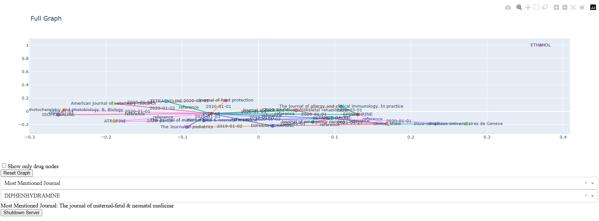
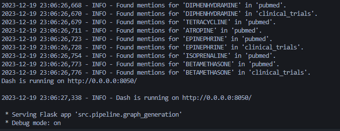

# Data Engineering Pipeline Project

## Project Overview
This project is designed to demonstrate a simple data engineering pipeline that processes, analyzes, and visualizes data. It utilizes Python for data processing and analysis, with a specific focus on drug mention extraction from various sources and network graph visualization using Dash. Additionally, the project is Dockerized for easy deployment and consistent runtime environments.
<p float="left">
  <a href="../static/dash_panel_view.png" target="_blank"></a>
</p>

This directory mirrors the processes found in the [Airflow](../Airflow/) folder,but with a simpler job design to provide more detailed insights into the functionality. Feel free to consult the [README](../Airflow/README.md)  for additional information
### Key Components
- **Data Loading and Cleaning**: Load raw data, clean, and standardize it.
- **Mention Extraction**: Extract mentions of drugs from various data sources.
- **Graph Generation**: Create network graphs representing relationships between drugs and sources.
- **Data Visualization**: Interactive graph visualization using Dash.
- **Docker Integration**: Containerization of the application for deployment.

## Setup and Installation

### Prerequisites
- Python 3.11
- Docker (for Dockerized deployment)

### Local Setup
This is if you want install a virtual_env and tested in local and not using the **Dockerfile** and **pipeline.sh**
1. Clone the repository.
2. Navigate to the project directory.
3. Install dependencies:
   ```
   python -m venv simple_flow 
   pip install -r requirements.txt
   ```
4. Run the pipeline:
   ```
   python path_to_pipeline_script.py
   ```

### Docker Setup
To gain time use the **pipeline.sh** which creates the stesps marked bellow.
1. Build the Docker image:
   ```
   docker build -t simple_flow .
   ```
2. Run the Docker container:
   ```
   docker run -v /path/to/data:/usr/src/data simple_flow
   ```

## Using the Application
Upon running the pipeline, you will observe the following steps being executed:
- Data is loaded and cleaned.
- Mentions of drugs are extracted and processed.
- A network graph is generated and visualized in a Dash web application.

The Dash application provides interactive visualization capabilities. You can explore the graph, view specific drug mentions, and perform analysis like identifying the most mentioned journal. You should enter to the local address which is shown in docker log or to be specific set in **/src/pipeline/graph_genetaion.py** in [here](https://github.com/HaddedAmine/Data_engineer_test/blob/master/simpleflow/src/pipeline/graph_generation.py#L202).
<p float="left">
  
</p>

## Note 
 The link will not be displayed automatically feel free to open it in your browser http://127.0.0.1:8050.  ALso I have not yet done yet the part of shutting down the server from the dash! so you have just ``` ctrl + c ``` to shutdown the docker.
## Docker Integration
The application is Dockerized to ensure consistent environments across different setups. The `Dockerfile` includes instructions for creating a Docker image with all necessary dependencies.

## Note
- The pipeline has been tested in both local and Docker environments. Please note that Docker deployment may require more resources and is based on an older version of Airflow.

## Acknowledgements
This project is part of a data engineering exercise and is intended for demonstration purposes only.
